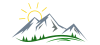

<h1 align="center">  </h1>

# Photo usage and other legal mumbo jumbo :bowtie:

<h2 align="center">©</h2>

_I work hard at creating these photos. I really hope you like them and come back often to see more images as time goes by. However, copying, hotlinking and downloading is stealing and I really hope that you won’t do these things. That being said, here is the legalese version that I hate to post but trust that you will respect:_

All images appearing in the Baldurs Photography web site and blog, unless noted otherwise, are the exclusive property of Bjarne Varöystrand and are protected under Swedish, European Union and International Copyright laws. The images may not be reproduced, copied, transmitted or manipulated without the written permission of Bjarne Varöystrand. These copyright laws impose substantial penalties for infringement, and violators will be prosecuted to the full extent of the law.

The use of any images or other materials included herein, in whole or in part, for any purpose other than the private purpose of viewing them online, including, but not limited to, copying, reproduction, publication (including on Internet Web Site including third party web pages by any means, including “hotlinking”, storage in a retrieval system (other than internet browser), manipulation (digital or otherwise), or transmitted in any form or by any means, electronic, mechanical, photocopying, recording or otherwise, is expressly prohibited without the written permission of Bjarne Varöystrand. All artistic and moral rights of the author are hereby asserted.

Limited use of the watermarked low-resolution images displayed on this web site is permitted for non-commercial blogs and selected editorial web sites with the following conditions:

* Permission to use any images on this website must be requested in advance. Please contact me with the URL of the page where the images will be posted on your web site.
* It is not permitted to remove or crop the copyright watermark from my images.
* A photo credit link to my website must be placed on any web page where the images is used.
* Photo credit links must be valid HTML and contain no javascript, redirects, or link-blocking code such as nofollow tags. All links back to my site must remain unblocked for as long as the images is used.

No images are within the public domain.

All images are copyrighted © Bjarne Varöystrand

For information about reproduction rights and rates, for any of the images contained within this site, please contact Bjarne Varöystrand.
Use of this web site constitutes acceptance with the above copyright notice and all terms and conditions presented here.

### end of :copyright: notice

## The short version:

_Please ask me if you want to use my photos or anything I’ve written._

It’s the nice, honest, and right thing to do.

Thanks!

:relaxed:
